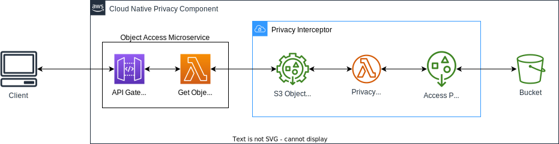

# Advanced Privacy Friendly Access Control Component for aws s3 buckets

## Prerequisites

To make our component reusable we used the AWS Serverless Application Model, a guide on how it can be installed can be found [here](https://docs.aws.amazon.com/serverless-application-model/latest/developerguide/serverless-sam-cli-install.html)

In addition, the [aws cli](https://docs.aws.amazon.com/de_de/cli/latest/userguide/getting-started-install.html) is needed.

## How to get started with the prototype

## How to get started with the privacy component

In order to add our privacy component in front of an existing s3 bucket we recommend to use aws cloudformation or aws sam and import our privacy component as a nested stack. Which can be seen in our [prototype](./backend/template.yaml). 

### Adding new interceptors
### Adding custom auth functions
### Adding custom filter (transformation) functions

### Deploy the component

### Deploy the prototype

    "sam package --region eu-central-1 --s3-bucket <BUCKET_NAME> --output-template-file output-template.yaml",

    "sam deploy --stack-name <BUCKET_NAME> --template-file output-template.yaml --capabilities CAPABILITY_IAM CAPABILITY_AUTO_EXPAND",

Further Resources:
- [AWS Blogpost](https://aws.amazon.com/de/blogs/storage/managing-access-to-your-amazon-s3-objects-with-a-custom-authorizer/)